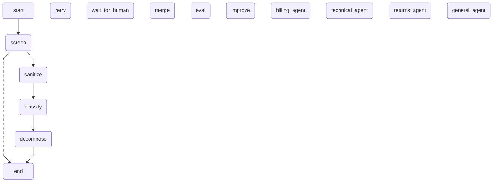

```mermaid
---
config:
  flowchart:
    curve: linear
---
graph TD;
	__start__(<p>__start__</p>)
	screen(screen)
	sanitize(sanitize)
	classify(classify)
	decompose(decompose)
	retry(retry)
	wait_for_human(wait_for_human)
	merge(merge)
	eval(eval)
	improve(improve)
	billing_agent(billing_agent)
	technical_agent(technical_agent)
	returns_agent(returns_agent)
	general_agent(general_agent)
	__end__(<p>__end__</p>)
	__start__ --> screen;
	classify --> decompose;
	sanitize --> classify;
	screen -.-> __end__;
	screen -.-> sanitize;
	decompose --> __end__;
	classDef default fill:#f2f0ff,line-height:1.2
	classDef first fill-opacity:0
	classDef last fill:#bfb6fc
```
